<div align="center" style="line-height: 1.15;">
  <br><br>
  
  <h2>Universidad Tecnológica del Norte de Guanajuato</h2>
  <p><strong>30 de Mayo 2026</strong></p>
  
  <h3>Automatización de Infraestructura Digital</h3>
  <h4>Instrumento de Evaluación</h4>
  <h4>Unidad I. Entornos de desarrollo en la automatización de redes</h4>
  
  <br>
  <p><strong>Docente:</strong><br>
  Erick Domenzain Morales</p>
  
  <p><strong>Integrantes:</strong><br>
  Héctor Daniel Beltrán Gutiérrez - 1223100387</p>

</div>
 
## Índice
 
1. [Introducción](#introducción)
2. [Desarrollo](#desarrollo)
   - [Descripción de las herramientas de desarrollo](#descripción-de-las-herramientas-de-desarrollo)
   - [Procedimiento de instalación](#procedimiento-de-instalación)
   - [Evidencia de pruebas de verificación de funcionamiento](#evidencia-de-pruebas-de-verificación-de-funcionamiento)
3. [Conclusión](#conclusión)
4. [Anexos: Recursos de la comunidad](#anexos-recursos-de-la-comunidad)
5. [Bibliografía](#bibliografía)
---
 
## Introducción
 
<div align="justify" style="line-height: 1.15;">
El presente reporte detalla de manera exhaustiva el procedimiento de instalación, configuración y validación de las herramientas esenciales para establecer un entorno de desarrollo profesional orientado a la automatización de redes y la gestión de infraestructura digital. En el panorama tecnológico actual, la capacidad de desplegar aplicaciones y servicios de red de forma consistente y reproducible es un pilar fundamental de la ciberseguridad y la administración de sistemas. La automatización elimina el error humano, optimiza los tiempos de entrega y permite mantener políticas de seguridad estrictas en infraestructuras complejas, ya sean servidores locales, entornos virtualizados en Proxmox VE o despliegues en la nube pública.
 
Este documento consta de diversas secciones críticas que abordan desde la concepción teórica de las herramientas hasta su implementación práctica. Inicialmente, se expone una descripción técnica de las tecnologías seleccionadas, incluyendo Docker Engine, Docker Compose y Docker Swagger, destacando su relevancia en la orquestación de contenedores y la documentación de interfaces de programación de aplicaciones (APIs). Posteriormente, se documenta paso a paso la instalación técnica de estos componentes, así como del editor de código Visual Studio Code y el sistema de control de versiones Git, garantizando que el entorno de desarrollo sea robusto y altamente colaborativo.
 
La actividad práctica de esta unidad consistió en el despliegue de una aplicación completa de Sistema de Ventas mediante Docker Compose, integrando cuatro servicios interconectados: una base de datos MySQL, una interfaz de administración PhpMyAdmin, un servidor backend en Node.js y un servidor frontend con Nginx. Este ejercicio no solo solidifica las bases prácticas en la creación de contenedores y microservicios, sino que también prepara el terreno para la orquestación avanzada en unidades posteriores del curso.
 
</div>
---

## Desarrollo
 
### Descripción de las herramientas de desarrollo
 
<div align="justify" style="line-height: 1.15;">
- **Docker Engine:** Es la tecnología principal subyacente que permite crear y ejecutar contenedores de software de manera aislada. Funciona como un motor cliente-servidor, donde el demonio de Docker gestiona imágenes, contenedores, redes y volúmenes, permitiendo empacar aplicaciones con todas sus dependencias para asegurar que funcionen de manera idéntica en cualquier entorno de hardware o sistema operativo.
- **Docker Compose:** Es una herramienta diseñada para definir y ejecutar aplicaciones Docker de múltiples contenedores. Utiliza un archivo YAML (`.yml`) para configurar los servicios, redes y volúmenes de la aplicación. Con un solo comando (`docker-compose up`), Compose permite inicializar todos los servicios declarados, simplificando drásticamente el despliegue de infraestructuras complejas, como arquitecturas que requieren bases de datos acopladas a servidores web.
- **Docker Swagger (OpenAPI):** Es un conjunto de herramientas de código abierto construido alrededor de la especificación OpenAPI que ayuda a diseñar, construir, documentar y consumir APIs RESTful. Al integrarse y desplegarse mediante Docker, permite a los desarrolladores y administradores de red contar con un entorno local estandarizado para probar puntos finales de red y automatizar la generación de documentación técnica interactiva.
</div>
---
 
### Procedimiento de instalación
 
#### Entorno de virtualización
 
<div align="justify" style="line-height: 1.15;">
Todo el entorno de desarrollo fue configurado sobre una máquina virtual con **Ubuntu Server 22.04 LTS** ejecutada en **Oracle VirtualBox**. Se descargó la imagen ISO oficial de Ubuntu Server desde [https://ubuntu.com/download/server](https://ubuntu.com/download/server) y se creó una máquina virtual con los recursos necesarios (memoria RAM, almacenamiento y adaptador de red en modo puente) para garantizar conectividad con el equipo anfitrión. Esta arquitectura de virtualización permite reproducir el entorno de manera aislada y consistente, simulando un servidor real de producción.
 
</div>

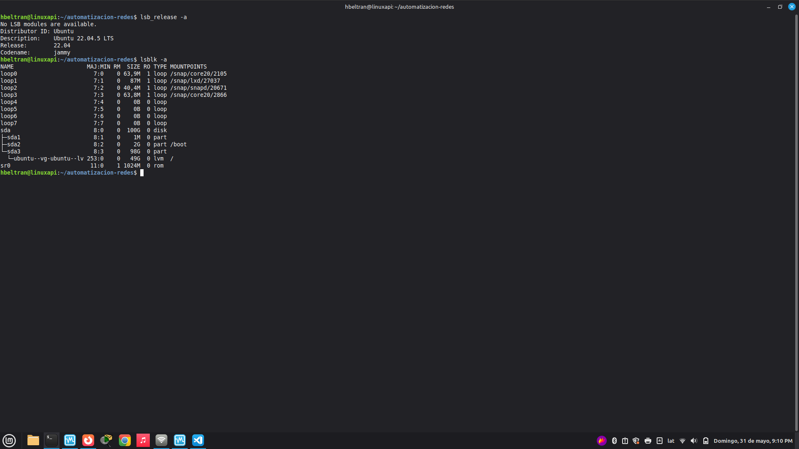
 
---
 
#### 1. Instalación de Visual Studio Code y Plugins
 
<div align="justify" style="line-height: 1.15;">
Visual Studio Code se instaló en el equipo anfitrión (host) desde el sitio oficial [https://code.visualstudio.com/](https://code.visualstudio.com/). Para trabajar de forma remota sobre la máquina virtual, se utilizó la extensión **Remote - SSH**, que permite editar archivos directamente en el servidor Ubuntu desde el editor local. Adicionalmente se instalaron las siguientes extensiones clave:
 
- **Docker** — Gestión de contenedores e imágenes desde el editor.
- **YAML** — Soporte para sintaxis y validación de archivos `.yml`.
- **GitLens** — Integración avanzada con el historial de Git.
- **Remote - SSH** — Conexión y edición remota sobre la máquina virtual.
</div>

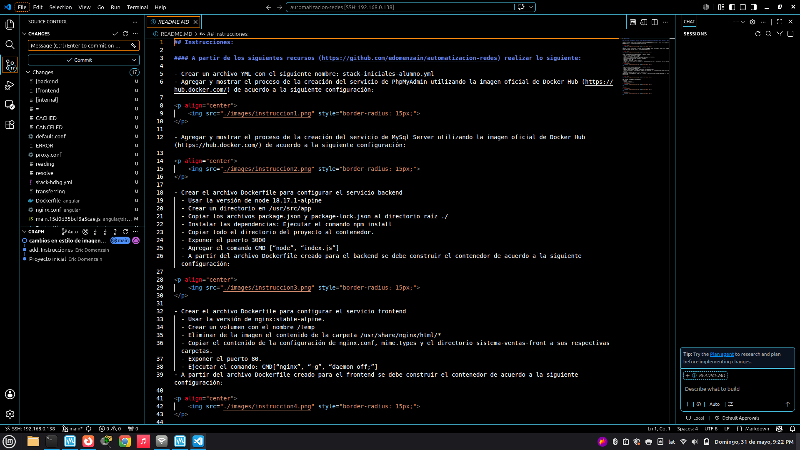
 
---
 
#### 2. Instalación de Docker en Ubuntu Server 22.04
 
<div align="justify" style="line-height: 1.15;">
La instalación de Docker Engine se realizó directamente en la máquina virtual con Ubuntu Server 22.04 siguiendo el procedimiento oficial para distribuciones basadas en Debian. Los comandos ejecutados fueron los siguientes:
 
</div>
- **Actualizar el índice de paquetes e instalar dependencias:**
```shell
sudo apt-get update
sudo apt-get install -y ca-certificates curl gnupg
 
# Agregar la clave GPG oficial de Docker
sudo install -m 0755 -d /etc/apt/keyrings
curl -fsSL [https://download.docker.com/linux/ubuntu/gpg](https://download.docker.com/linux/ubuntu/gpg) | sudo gpg --dearmor -o /etc/apt/keyrings/docker.gpg
sudo chmod a+r /etc/apt/keyrings/docker.gpg
 
# Agregar el repositorio oficial de Docker
echo \
  "deb [arch=$(dpkg --print-architecture) signed-by=/etc/apt/keyrings/docker.gpg] \
  [https://download.docker.com/linux/ubuntu](https://download.docker.com/linux/ubuntu) \
  $(. /etc/os-release && echo "$VERSION_CODENAME") stable" | \
  sudo tee /etc/apt/sources.list.d/docker.list > /dev/nulll
 
# Instalar Docker Engine y Docker Compose
sudo apt-get update
sudo apt-get install -y docker-ce docker-ce-cli containerd.io docker-buildx-plugin docker-compose-plugin
 
# Agregar el usuario al grupo docker para ejecutar sin sudo
sudo usermod -aG docker $USER
 
# Verificar instalación
docker --version
docker compose version

```
 

---
 
#### 3. Instalación de Git en Ubuntu Server 22.04
 
<div align="justify" style="line-height: 1.15;">
Git viene preinstalado en Ubuntu Server 22.04; sin embargo, se verificó su versión y se realizó la configuración global del usuario con los siguientes comandos:
 
</div>
```shell
# Verificar versión (o instalar si no está disponible)
sudo apt-get install -y git
git --version
 
# Configurar identidad global
git config --global user.name "Héctor Daniel Beltrán Gutiérrez"
git config --global user.email "tu-correo@ejemplo.com"
```
 
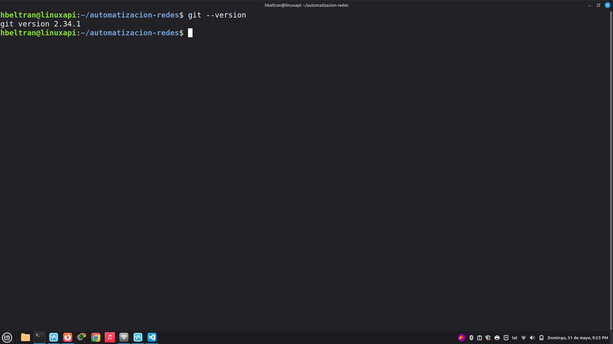
 
---
 
### Evidencia de pruebas de verificación de funcionamiento
 
#### Ejecución de la imagen `hello-world` para verificar Docker
 
<div align="justify" style="line-height: 1.15;">
Para asegurar que el demonio de Docker estuviera corriendo correctamente, se ejecutó el siguiente comando en la terminal:
 
</div>
```shell
docker run hello-world
```
 
<div align="justify" style="line-height: 1.15;">
Docker descargó automáticamente la imagen `hello-world` desde Docker Hub y ejecutó el contenedor, mostrando el mensaje de confirmación. Esto indica que el motor de Docker está instalado y funcionando correctamente.
 
</div>

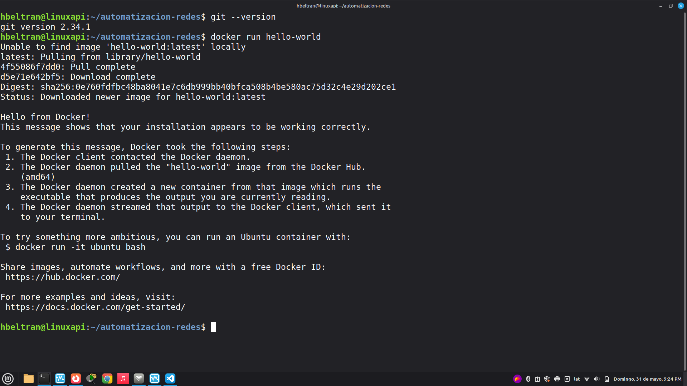
 
---
 
#### Ejecución del archivo `.YML` para verificar el funcionamiento de contenedores
 
<div align="justify" style="line-height: 1.15;">
Se creó y ejecutó el archivo `stack-hdbg.yml` (Actividad 2) con todos los servicios configurados. Para iniciar el stack completo se utilizó el siguiente comando:
 
</div>
```shell
docker-compose -f stack-hdbg.yml up -d
```

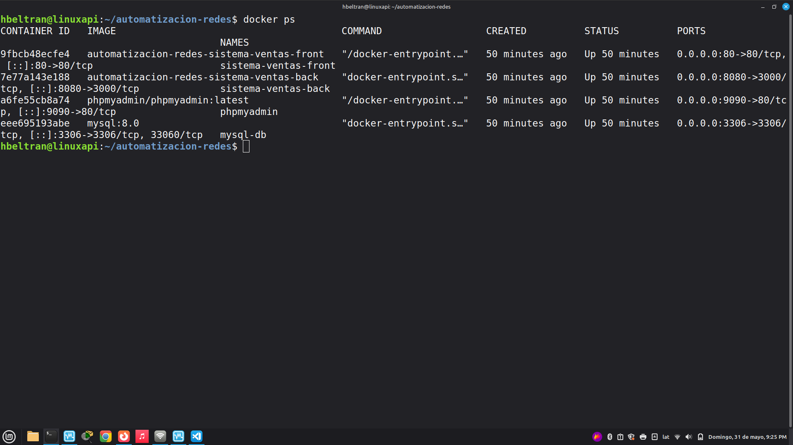
 
---
 
## Actividad 2 — Configuración de la Aplicación
 
### Archivo `stack-hdbg.yml`
 
<div align="justify" style="line-height: 1.15;">
A partir de los recursos del repositorio del profesor ([https://github.com/edomenzain/automatizacion-redes](https://github.com/edomenzain/automatizacion-redes)), se creó el archivo de orquestación con los cuatro servicios requeridos:
 
</div>
```yaml
version: '3.8'
 
services:
 
  # ── Servicio PhpMyAdmin ──────────────────────────────────────
  phpmyadmin:
    image: phpmyadmin:latest
    container_name: phpmyadmin
    ports:
      - "9090:80"
    environment:
      - PMA_ARBITRARY=1
    depends_on:
      - mysql-db
 
  # ── Servicio MySQL ───────────────────────────────────────────
  mysql-db:
    image: mysql:8.0
    container_name: mysql-db
    ports:
      - "3306:3306"
    volumes:
      - dbfiles:/var/lib/mysql
    environment:
      MYSQL_ROOT_PASSWORD: qwerty
      MYSQL_DATABASE: sistema_ventas_db
      MYSQL_USER: admin
      MYSQL_PASSWORD: admin
 
  # ── Servicio Backend (Node.js) ───────────────────────────────
  sistema-ventas-back:
    image: node:18.17.1-alpine
    build: ./backend
    container_name: sistema-ventas-back
    ports:
      - "8080:3000"
    depends_on:
      - mysql-db
 
  # ── Servicio Frontend (Nginx) ────────────────────────────────
  sistema-ventas-front:
    build: ./frontend
    container_name: sistema-ventas-front
    ports:
      - "80:80"
    depends_on:
      - sistema-ventas-back
 
volumes:
  dbfiles:
```
 
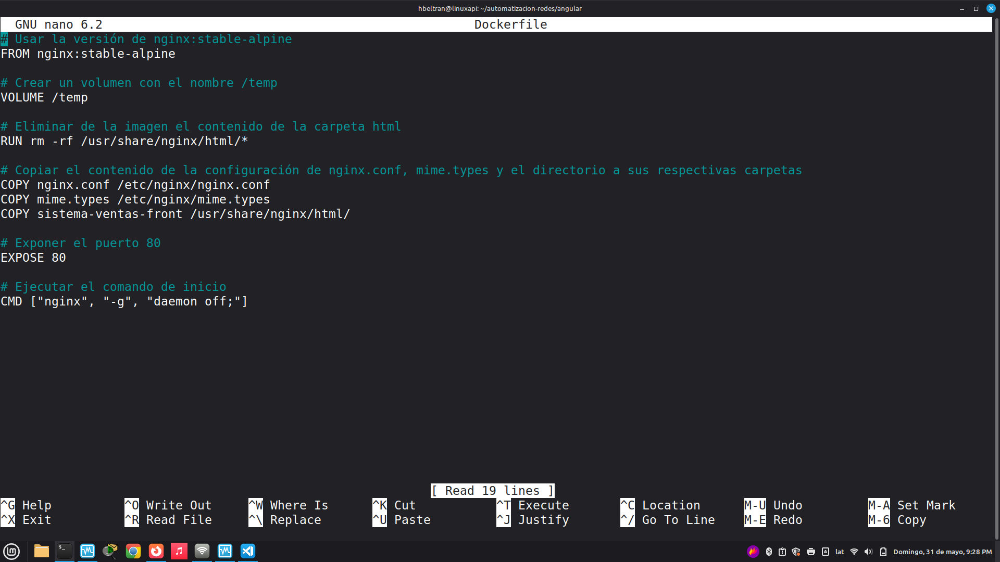
 
---
 
### Dockerfile — Backend (Node.js)
 
```dockerfile
FROM node:18.17.1-alpine
 
WORKDIR /usr/src/app
 
COPY package.json package-lock.json ./
 
RUN npm install
 
COPY . .
 
EXPOSE 3000
 
CMD ["node", "index.js"]
```
 
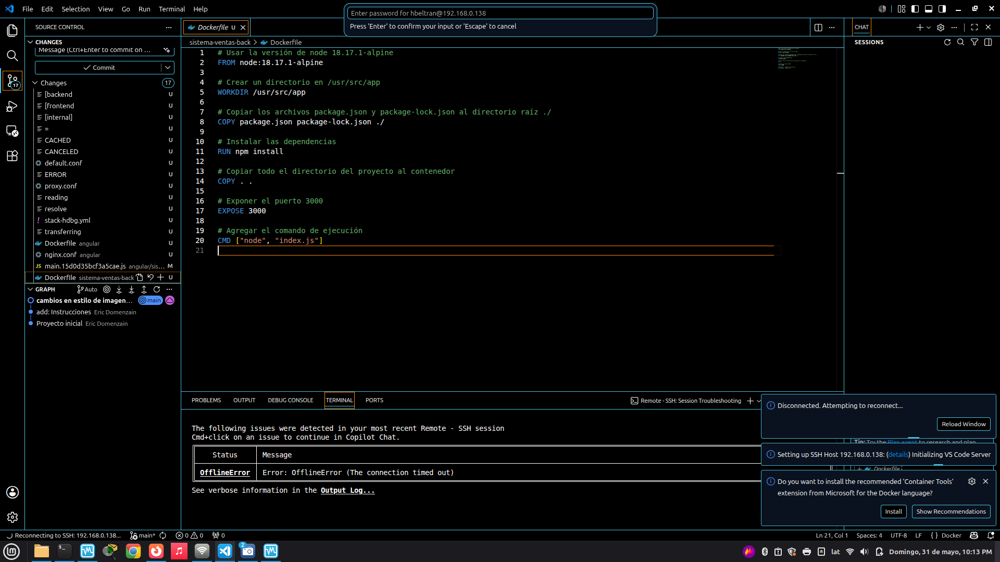
 
---
 
### Dockerfile — Frontend (Nginx)
 
```dockerfile
FROM nginx:stable-alpine
 
VOLUME ["/temp"]
 
RUN rm -rf /usr/share/nginx/html/*
 
COPY nginx.conf /etc/nginx/nginx.conf
COPY mime.types /etc/nginx/mime.types
COPY sistema-ventas-front/ /usr/share/nginx/html/
 
EXPOSE 80
 
CMD ["nginx", "-g", "daemon off;"]
```
 

 
---
 
### Resultado Final
 
<div align="justify" style="line-height: 1.15;">
Una vez ejecutado el comando `docker-compose up`, los cuatro servicios se desplegaron correctamente. A continuación se muestra la verificación de cada uno:
 
</div>
**Frontend — Sistema de Ventas** (`http://localhost/home`)
- Usuario: `admin`
- Contraseña: `12345678`

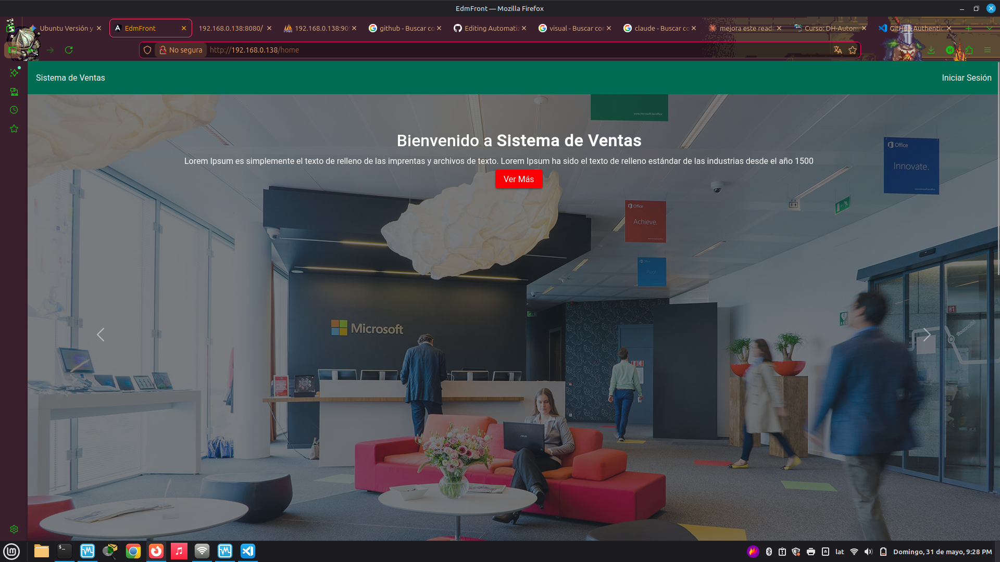
 
**Backend — API Node.js** (`http://localhost:8080`)
 
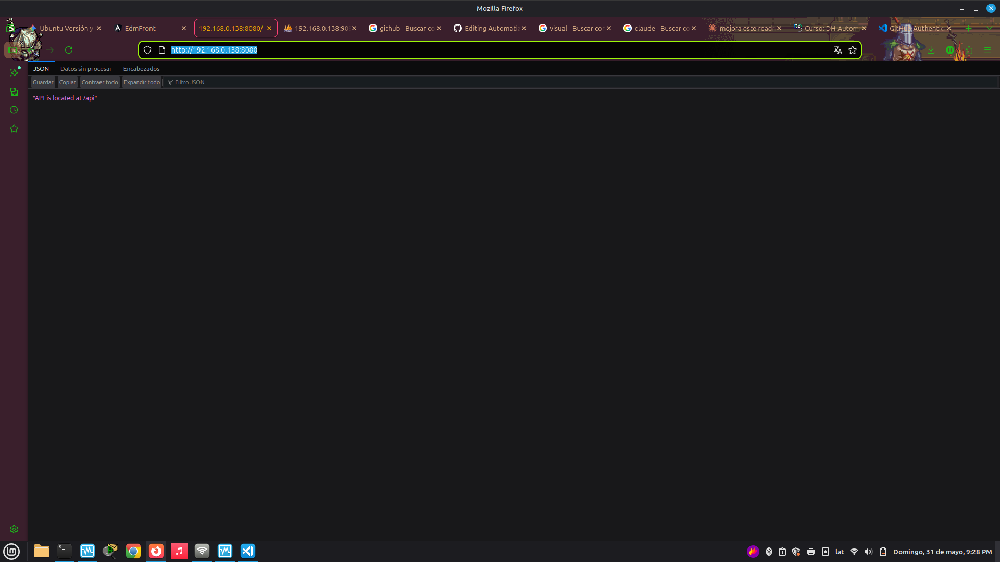
 
**PhpMyAdmin** (`http://localhost:9090`)
 
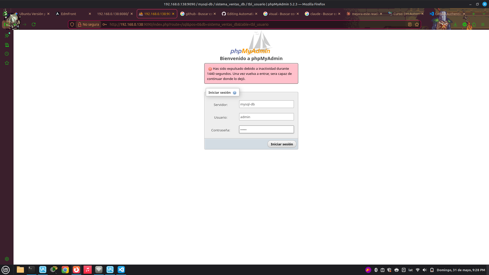
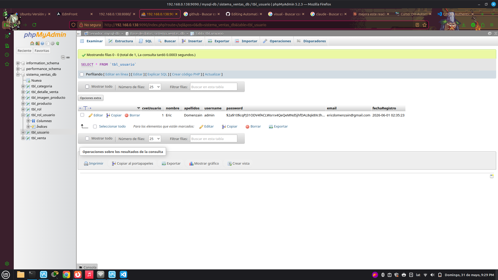
 
---
 
## Conclusión
 
<div align="justify" style="line-height: 1.15;">
Héctor Daniel Beltrán Gutiérrez — A lo largo del desarrollo de la Unidad I, se logró implementar exitosamente un entorno de desarrollo completo para la automatización de redes e infraestructura digital. La instalación y configuración de herramientas como Docker Engine, Docker Compose, Visual Studio Code y Git proporcionaron una base sólida y reproducible para el trabajo con contenedores y microservicios.
 
El ejercicio más relevante consistió en el despliegue de una aplicación de Sistema de Ventas con arquitectura de cuatro capas, donde se integró una base de datos MySQL, una herramienta de administración PhpMyAdmin, un servidor backend desarrollado en Node.js y un servidor frontend servido mediante Nginx. La creación de los archivos Dockerfile para el backend y frontend demostró en la práctica cómo se empaqueta y configura cada servicio de forma independiente, para posteriormente orquestarlos mediante un único archivo Docker Compose.
 
Entre los hallazgos más importantes se destacan: la importancia de la gestión de dependencias entre servicios mediante la directiva `depends_on`, el uso de volúmenes persistentes para la base de datos, y la correcta configuración de variables de entorno para la seguridad de credenciales. Este proceso refuerza la comprensión de principios fundamentales de DevOps aplicados a la administración de infraestructura de red.
 
</div>
---
 
## Anexos: Recursos de la comunidad
 
- Repositorio del curso: [https://github.com/edomenzain/automatizacion-redes](https://github.com/edomenzain/automatizacion-redes)
- Docker Hub — Imágenes oficiales utilizadas: [https://hub.docker.com/](https://hub.docker.com/)
  - `phpmyadmin:latest`
  - `mysql:8.0`
  - `node:18.17.1-alpine`
  - `nginx:stable-alpine`
- Documentación oficial de Docker Compose: [https://docs.docker.com/compose/](https://docs.docker.com/compose/)
- Documentación oficial de Docker Engine: [https://docs.docker.com/engine/](https://docs.docker.com/engine/)
---
 
## Bibliografía
 
<div align="justify" style="line-height: 1.15;">
Bell, P. (2014). *Introducing GitHub: A non-technical guide*. O'Reilly Media.
 
Gift, N., Behrman, K., Deza, A., & Gheorghiu, G. (2019). *Python for DevOps: Learn ruthlessly effective automation*. O'Reilly Media.
 
Hillar, G. C. (2016). *Building RESTful Python web services*. Packt Publishing.
 
Jackson, C., Ratliff, J., Watts, J., & Donohue, B. (2020). *Cisco certified DevNet associate DEVASC 200-901 official cert guide*. Cisco Press.
 
Lenz, M. (2018). *Python continuous integration and delivery: A concise guide with examples*. Apress.
 
Tsitoara, M. (2019). *Beginning Git and GitHub: A comprehensive guide to version control, project management, and teamwork for the new developer*. Apress.
 
</div>
 
